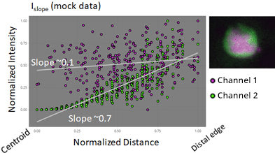

- [predictSD](#predictsd)
    + [Installation](#installation)
  * [labelCollect.py](#labelcollectpy)
    + [Output](#output)
  * [Usage](#usage)
    + [Memory Management](#memory-management)
  * [Models](#models)
  * [Additional info](#additional-info)
    + [Intensity slope](#intensity-slope)
    + [dropHeaders.py](#dropheaderspy)
  * [Citation](#citation)
    + [LAM - Linear Analysis of Midgut](#lam---linear-analysis-of-midgut)
  * [License](#license)
  * [Authors](#authors)
  * [Acknowledgements](#acknowledgements)
  * [References](#references)

<small><i><a href='http://ecotrust-canada.github.io/markdown-toc/'>Table of contents generated with markdown-toc</a></i></small>


# predictSD
**Prediction of cellular objects in 2D/3D using StarDist<sup>(1,2)</sup> and collection of label information into a data
table.** The collected information includes object positions, maximal areas, volumes, and multiple intensity variables.
The data can automatically be saved in LAM-usable format, if so wanted. PredictSD can also be used to collect
information on objects within TIFF-images from any segmentation source when provided together with the intensity images 
and if each label in the segmentation images is marked by a single, unique value.


### Installation  
PredictSD requires an environment that is capable of running StarDist. For additional information, see
[StarDist's GitHub-page](https://github.com/stardist/stardist/). Required packages are listed in
'docs/requirements.txt'. For installation on Win10 using CUDA 11.4, see 'docs/environment_setup.txt'.

------------------------

## labelCollect.py  

The whole process is handled through labelCollect.py, which contains information on use (open file in text editor). The
only input required (sans the settings) are tiff-images with axes order of '(Z)(C)YX', i.e. ImageJ-format. The images can
contain multiple channels, and a separate prediction model can be applied to each one of them.

### Output

LabelCollect.py outputs tiff-images of the predicted labels and saves label information to either LAM-runnable
folders/files or dumps them in a single output folder. If given a path to a Fiji/ImageJ<sup>(3)</sup> executable, the 
prediction can create z-projected 2D overlays of the image/label pairs by calling predictSD/overlayLabels.ijm.

The result tables include the following columns: <samp>'ID', 'Z', 'Y', 'X', 'Volume', 'Area', 'IntensityMean', 
'IntensityMin', 'IntensityMax', 'IntensityMedian', 'IntensityStdDev',</samp> and <samp>'IntensitySlope'</samp>. The 
<samp>'IntensitySlope'</samp> represents the object's pixel-wise intensity distribution as a function of distance from 
centroid, where negative and positive values indicate a central and outward intensity localisation, respectively. See 
segment [Additional info](#Additional info) for more about the slope calculation. All intensity values are calculated 
for **all** channels in the image and have their column names appended with suffix <samp>'_Ch='</samp> plus the 
channel's index.

------------------------

## Usage  
**The simplest way to perform label prediction and data collection is to edit the variables on top of labelCollect.py
and then run the file.** The script is designed to analyze all tiff-images found at an input path.

Alternatively, you can import predictSD and create a new pipeline (if predictSD can be found in system paths). In the
snippet below, a single image file is used to create a `ImageData`-object that handles tiff-files and holds 
necessary metadata. The image data is then passed to `PredictObjects` for the upcoming segmentation.

```python
# Add predictSD-master to system paths
import sys
sys.path.append("/path/to/predictSD-master/")                   # Replace path
import predictSD as ps

label_out = r"C:\testSet\labels"
res_out = r"C:\testSet\results"

image = ps.ImageData(r"C:\testSet\ctrl_2021_101657.tif")
config = {'return_details': False,
          'sd_models': ("GFP10x", "DAPI10x"),                   # Names of models to apply for the image
          'prediction_chs': (0, 1),                             # Respective channel indices to apply the models on
          'imagej_path': r"C:\Fiji.app\ImageJ-win64.exe"}       # Allows creation of flat image/label overlays
predictor = ps.PredictObjects(image, **config)                  # Initiate prediction class
```
The given models are applied to the image by calling the `PredictObjects`- instance, here named <samp>predictor</samp>. 
As a result, a tiff-file with the labels is created to the output-path and its path is stored to the `ImageData`-instance.
The `ImageData`-instance can then be directly provided to `CollectLabelData` to collect information on the segmented objects. 
```python
predictor(out_path=label_out, overlay_path=res_out)             # Perform prediction for objects in image
lbldata = ps.CollectLabelData(image, convert_to_micron=True)    # Initiate class for collecting label information

# Collect object intensities, area, volume, etc.
lbldata(out_path=res_out, lam_compatible=True, save_data=True, 
        filters=[('all', 'Area', 15.0, 'min')])                 # Filters can also be applied to the label information
```
All output data is saved to <samp>out_path</samp> if <samp>save_data</samp> is `True`, but can also be accessed via the 
<samp>output</samp>-attribute of `CollectLabelData`, either by indexing with an integer or with the label-image's path.
The output of predictions is stored in the order of execution, and corresponds to the order of <samp>label_paths</samp>-
attribute of `ImageData` and `PredictObjects`.
```python
# Accessing a dataset in the output returns a tuple with model's name, label-image path, and DataFrame with labels.
(model, _, lbltable) = lbldata.output[r"C:\testSet\labels\ctrl_2021_101657_GFP10x.labels.tif"]
(model_2, label_file, _) = lbldata.output[1]

# Print model name and DataFrame header of the first output item
print(model, '\n', lbltable.head())
# Show name and path of second item
print(model_2, label_file)
```
```console
Out[1]: GFP10x 
              Y           X  ...  Intensity Max  Intensity StdDev
ID                          ...                                 
1   223.365854  462.327913  ...             97         13.854036
2   395.653355  317.261981  ...             85          9.642595
3   353.309524  214.336735  ...             97         12.983975
4   275.065967  228.928036  ...            112         13.977829
5   435.916413  217.325228  ...            125         14.913771

[5 rows x 8 columns]

Out[2]: DAPI10x C:\testSet\labels\ctrl_2021_101657_DAPI10x.labels.tif
```

`PredictObjects` also accepts instances of `StarDist2D` or `StarDist3D` models instead of bare name-strings. 
Additionally, similar to predictSD-models, the 2D pre-trained models of StarDist, i.e., the provided fluorescent and H&E 
stained models can be used with only their names: <samp>'2D_versatile_fluo'</samp> and <samp>'2D_versatile_he'</samp>, 
respectively.
```python
from stardist.models import StarDist2D                          # Stardist models are also imported through predictSD

config = {'prediction_chs': 0,
          'sd_models':
    StarDist2D.from_pretrained('2D_versatile_fluo')             # Load pretrained model instead of using a namestring
          }
image = ps.ImageData(r"C:\testSet2D\C2-210205_ctrlproj.tif")    # Load 2D image
details = ps.PredictObjects(image, **config                     # Direct call for prediction, with details returned
                            )(out_path=label_out,
                              return_details=True) 
```

If labels already exist, the images must be named <samp>"samplename.tif(f)"</samp> and
<samp>"samplename(_channelname).labels.tif(f)"</samp>, where text inside parentheses are optional. For example, if name
of an image is <samp>"ctrl_1146.tif"</samp> then labels could be named <samp>"ctrl_1146.labels.tif"</samp> or with
additional channel's or used model's name, e.g. <samp>"ctrl_1146_Ch=1.labels.tif"</samp> or 
<samp>"ctrl_1146_DAPI10x.labels.tif"</samp>, respectively.

Information from existing labels could be collected with:
```python
res_out = r"C:\testSet\results"
label_folder = r"C:\testSet\labels"

labels = ps.corresponding_imgs("ctrl_1146", label_folder)       # Find existing label files for an image.
image = ps.ImageData(r"C:\testSet\ctrl_1146.tif",               # Initiate class for collecting label information
                     paths_to_labels=labels)

# Channel names for the labels if missing/uninformative. Alternatively, set label_names=None
names = ("GFP", "DAPI")
# Initiate label collection and save results
ps.CollectLabelData(image, convert_to_micron=True, label_names=names
                    )(out_path=res_out, lam_compatible=True, save_data=True,
                      decimal_precision=3)                      # Definition of precision for the result file(s)
```
### Memory Management
Available GPU memory is a limiting factor for object prediction on larger images. The total GPU memory in megabytes and
allocatable fraction can be provided to <samp>prediction_config</samp> as a tuple when initiating `predictSD.PredictObjects`
with the keyword <samp>'memory_limit'</samp>. Similarly, the keyword <samp>'predict_big'</samp> can be set as `True` 
(default) to split the image into more manageable blocks. The number of divisions on each axis can be defined with the 
keywords <samp>'z_div'</samp>, <samp>'long_div'</samp>, and <samp>'short_div'</samp>. The smaller image blocks are 
defined by StarDist and include overlaps, i.e. the splitting should not affect quality of the segmentation at the edges.

```python
config = {'sd_models': "DAPI20x", 'prediction_chs': 1,
          'memory_limit': (8000, 0.9),                          # Allocate 90% of 8Gb total GPU memory
          'predict_big': True,                                  # Image will be split into blocks
          'z_div': 2,                                           # Blocks on Z-axis
          'long_div': 8,                                        # Blocks on the longer axis of XY
          'short_div': 3}                                       # Blocks on the shorter axis of XY
predictor = ps.PredictObjects(image, **config)  

```
------------------------
## Models

The models-folder contains lab-made StarDist3D models for the detection of cells on varying stains and magnifictations.
Self-created models can also be used with Labelcollect.py, either by placing the files in a folder
<samp>"predictSD-master/models/<model_name>"</samp>, or by passing the initialised model to `PredictObjects`.

| Model | Description | ZYX, &#181;m |
| --- | --- | --- |
| DAPI10x | Dmel adult midgut DAPI-stained nuclei. Aurox Clarity. | 8.20, 0.650, 0.650 |
| DAPI20x | Dmel adult midgut DAPI-stained nuclei. Aurox Clarity. | 3.40, 0.325, 0.325 |
| GFP10x | Dmel adult midgut ISC/EB-specific esg<sup>ts</sup> driver. Aurox Clarity. | 8.20, 0.650, 0.650 |
| GFP20x | Dmel adult midgut ISC/EB-specific esg<sup>ts</sup> driver. Aurox Clarity. | 3.40, 0.325, 0.325 |
| fatBody | 5d larvae fat body cell DAPI. Leica SP8 upright 20x.<sup>[A]</sup>| 1.040, 0.445, 0.445 |

&emsp;A. _The model was trained with images showing a phenotype where a sub-population of cells had smaller  
&emsp;nuclei. Consequently, the model may not be ideal for normal fat body._

**NOTE**: It is recommended to adjust the probability- and NMS-thresholds for your specific use-case to get the best
results. This can be accomplished by:
1. Editing <samp>thresholds.json</samp> in the model's folder (applied whenever model is used, unless overridden by 2. 
or 3.)
3. Modifying <samp>prediction_configuration</samp> keywords <samp>"probability_threshold"</samp> & <samp>"nms_threshold"
</samp> in  labelCollect.py (applied when labelCollect.py is executed)
4. Including the above keywords to `PredictObjects` config (applied by the instance) 

------------------------

## Additional info

### Intensity slope
**The slope calculation is a work-in-progress, lacking validation, and will most likely experience future changes.** The
intensity slope estimates the localisation of intensities within each segmented object (label) on all existing channels
of the image. Its value is the slope of a line fitted to pixel-wise, normalised [0,1] centroid distances and intensities
(see figure). The slope of each label is calculated separately for each image channel, which are then appended to 
result table in unique columns. 

  
&emsp;_**Figure 1.** Mock data of a label with two image channels with variable  
&emsp;intensities and the resulting intensity slopes._

### dropHeaders.py
Used to drop extra header rows from csv-files exported from Imaris. The files are expected to be in LAM-hierarchical
sample-folders. LAM expects all input data to have an exact index for column names, and removal of the headers is
required when combining data from Imaris with data from labelCollect.py.

------------------------
## Citation
If used for research, please cite the LAM-journal article below.
> Arto Viitanen, Josef Gullmets, Jack Morikka, Pekka Katajisto, Jaakko Mattila, Ville Hietakangas, An image analysis 
> method for regionally defined cellular phenotyping of the Drosophila midgut, Cell Reports Methods, Volume 1, Issue 5, 
> 2021, 100059, ISSN 2667-2375, https://doi.org/10.1016/j.crmeth.2021.100059.

### LAM - Linear Analysis of Midgut

Image analysis method for regionally defined organ-wide cellular phenotyping of the Drosophila midgut.
1. [Journal article](https://doi.org/10.1016/j.crmeth.2021.100059)

2. [Repository](https://github.com/hietakangas-laboratory/LAM)

3. [Tutorial videos](https://www.youtube.com/playlist?list=PLjv-8Gzxh3AynUtI3HaahU2oddMbDpgtx)

------------------------
## License
This project is licensed under the GPL-3.0 License  - see the LICENSE.md file for details

------------------------
## Authors
Arto I. Viitanen - [Hietakangas laboratory](https://www.helsinki.fi/en/researchgroups/nutrient-sensing)


## Acknowledgements  

Jaakko Mattila&emsp;- &emsp; [Mattila laboratory](https://www.helsinki.fi/en/researchgroups/metabolism-and-signaling/)  
Jack Morikka &emsp; - &emsp; <s>
[Mattila laboratory](https://www.helsinki.fi/en/researchgroups/metabolism-and-signaling/)
</s>&emsp; ( < 2021 )

------------------------
## References

1. Uwe Schmidt, Martin Weigert, Coleman Broaddus, and Gene Myers. Cell Detection with Star-convex Polygons.
    International Conference on Medical Image Computing and Computer-Assisted Intervention (MICCAI), Granada, Spain,
    September 2018. https://doi.org/10.1007/978-3-030-00934-2_30.  


2. Martin Weigert, Uwe Schmidt, Robert Haase, Ko Sugawara, and Gene Myers. Star-convex Polyhedra for 3D Object
    Detection and Segmentation in Microscopy. The IEEE Winter Conference on Applications of Computer Vision (WACV),
    Snowmass Village, Colorado, March 2020. https://doi.org/10.1109/WACV45572.2020.9093435


3. Schindelin, J., Arganda-Carreras, I., Frise, E. et al. Fiji: an open-source platform for biological-image analysis.
    Nat Methods 9, 676–682 (2012). https://doi.org/10.1038/nmeth.2019. 
